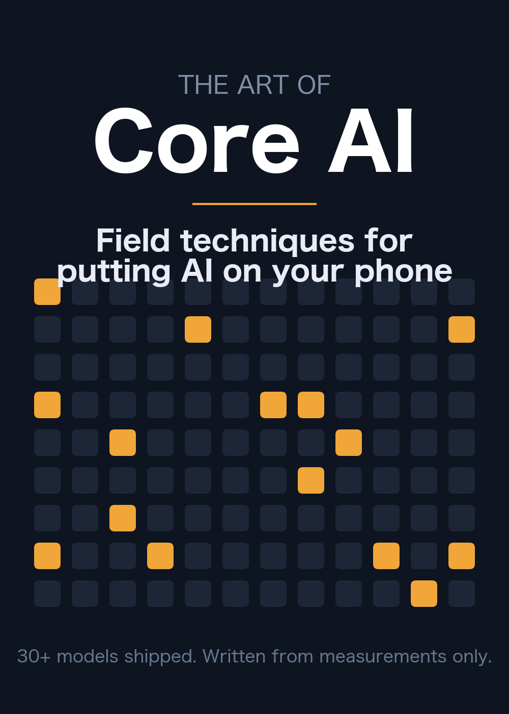

# The Art of Core AI

**Field techniques for putting AI on your phone — written entirely from real measurements.**

On-device AI is governed not by how fast the chip computes, but by **how many bytes you move**.
This book builds that thesis one measured fact at a time: 30+ models shipped to real iPhones and
Macs on Apple's Core AI framework (iOS/macOS 27) — LLMs, MoE, diffusion LLMs, speech, music,
vision — every number reproducible, every wrong guess kept in the text.

📕 **Read online:** https://john-rocky.github.io/the-art-of-core-ai/ (single page) — or browse the chapters below.
🇯🇵 The original Japanese edition is published on Zenn.

## Chapters

| # | Title |
|---|---|
| 1 | [It Wasn't Compute That Caught Up](chapters/01-it-wasnt-compute.md) |
| 2 | [11% of the Ceiling](chapters/02-eleven-percent.md) |
| 3 | [The Dedicated-Chip Misunderstanding](chapters/03-ane-misconception.md) |
| 4 | [Sixteen Levels](chapters/04-sixteen-levels.md) |
| 5 | [The Idle Experts](chapters/05-idle-experts.md) |
| 6 | [The Ever-Growing Past](chapters/06-growing-past.md) |
| 7 | [Grading Guesses](chapters/07-grading-guesses.md) |
| 8 | [The Silent Seconds](chapters/08-silent-seconds.md) |
| 9 | [Writing It All at Once](chapters/09-write-all-at-once.md) |
| 10 | [Watts, the Other Currency](chapters/10-watts-currency.md) |
| 11 | [The Law of Memory](chapters/11-law-of-memory.md) |
| 12 | [The Same Seat as First-Party](chapters/12-the-same-seat.md) |
| 13 | [Off the Rails](chapters/13-off-the-rails.md) |
| — | [Epilogue: How Many Bytes Did You Move?](chapters/14-epilogue.md) |

## Labs (hands-on)

| Lab | Title |
|---|---|
| 0 | [Environment Setup](chapters/lab-0-environment.md) |
| 1 | [Your First Conversion](chapters/lab-1-first-conversion.md) |
| 2 | [Driving It from Swift](chapters/lab-2-swift-runtime.md) |
| 3 | [Porting an LLM](chapters/lab-3-porting-an-llm.md) |
| 4 | [Shipping to iPhone](chapters/lab-4-shipping-to-iphone.md) |
| 5 | [Honest Measurement](chapters/lab-5-honest-measurement.md) |
| 6 | [Recipe Index](chapters/lab-6-recipe-index.md) |

## License

Text © the author. Code snippets are provided under the MIT license.
